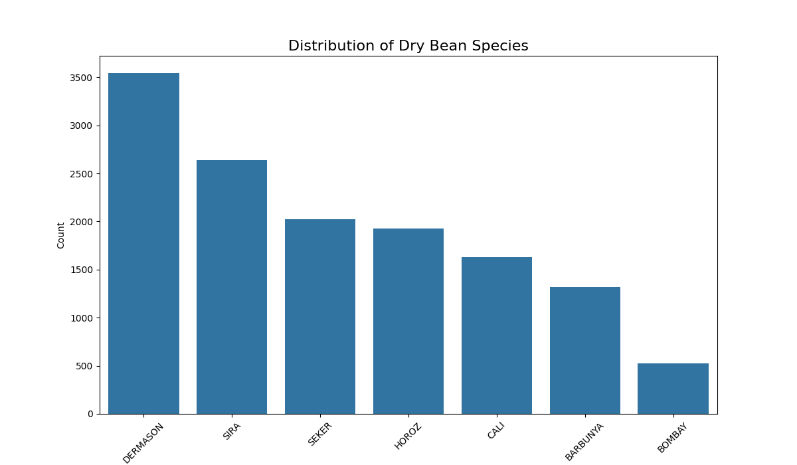

# 🫘 Dry Bean Species Classification Project

This project addresses a multi-class classification problem: identifying the species of a dry bean from one of seven varieties based on its physical shape measurements. This project serves as an excellent exercise in building a high-accuracy classifier on a clean, well-structured dataset, moving beyond binary classification into a more complex scenario.

## 📊 Dataset

The project uses the Dry Bean Dataset from the UCI Machine Learning Repository, which contains measurements from high-quality images of seven different registered dry bean species.  
**Data Source:** Dry Bean Dataset on Kaggle  
**File Used:** Dry_Bean.csv  

### Data Set Information:  
Seven different types of dry beans were used in this research, taking into account the features such as form, shape, type, and structure by the market situation. A computer vision system was developed to distinguish seven different registered varieties of dry beans with similar features in order to obtain uniform seed classification. For the classification model, images of 13,611 grains of 7 different registered dry beans were taken with a high-resolution camera. Bean images obtained by computer vision system were subjected to segmentation and feature extraction stages, and a total of 16 features; 12 dimensions and 4 shape forms, were obtained from the grains.

### Feature Descriptions
The dataset consists of 16 numerical features derived from image analysis, and one target variable:  
- **Shape Features:** Area, Perimeter, MajorAxisLength, MinorAxisLength, AspectRation, Eccentricity, ConvexArea, EquivDiameter, Extent, Solidity, roundness, Compactness.  
- **Derived Shape Factors:** ShapeFactor1, ShapeFactor2, ShapeFactor3, ShapeFactor4.  
- **Target Variable (Class):** The species of the bean (SEKER, BARBUNYA, BOMBAY, CALI, DERMASON, HOROZ, SIRA).  

## 🧹 Data Preprocessing

The dataset was very clean and contained no missing values, allowing the focus to be on preparing the data for the model.  
- **Target Encoding:** The Class column, containing the text names of the seven bean species, was converted into a numerical format (0 to 6) using scikit-learn's LabelEncoder.  
- **Feature Scaling:** All 16 numerical features were on different scales (e.g., Area vs. AspectRatio). A StandardScaler was applied to normalize all features, ensuring they were on a common scale. This is a crucial step for the performance of models like logistic regression.  

## 📈 Exploratory Data Analysis (EDA)

The EDA was performed to understand the class distribution and to see how well the features could separate the different bean species.

### Class Distribution  



- **Analysis:** The dataset is moderately imbalanced. The DERMASON species is the most frequent, while BOMBAY is the least. This imbalance is not extreme, but it was handled during the train-test split by using `stratify=y` to ensure each class was represented proportionally.

### Key Feature Analysis  


- **Analysis:** The box plots clearly show that the physical measurements are excellent predictors. Each species has a distinct shape profile. For example, the BOMBAY species is consistently the largest in terms of Perimeter and axis lengths, while the SEKER species is the most spherical, with the highest roundness and Compactness. This strong separation indicated that a classification model would likely perform very well.

## 🤖 Model Training

A LogisticRegression model was trained to perform the multi-class classification task.  
- **Data Splitting:** The dataset was split into an 80% training set and a 20% testing set using stratification to maintain the class balance.  
- **Model:** A standard LogisticRegression classifier from scikit-learn was used.

### Model Performance

The model achieved excellent performance on the unseen test data.

| Metric   | Score  |
|----------|--------|
| Accuracy | 0.9255 |

#### Classification Report:

| Class   | Precision | Recall | F1-Score | Support |
|---------|-----------|--------|----------|---------|
| BARBUNYA | 0.91      | 0.94   | 0.92     | 265     |
| BOMBAY   | 1.00      | 1.00   | 1.00     | 105     |
| CALI     | 0.94      | 0.92   | 0.93     | 325     |
| DERMASON | 0.91      | 0.94   | 0.92     | 713     |
| HOROZ    | 0.98      | 0.96   | 0.97     | 386     |
| SEKER    | 0.96      | 0.94   | 0.95     | 406     |
| SIRA     | 0.89      | 0.86   | 0.87     | 525     |

| Metric      | Value | Support |
|-------------|-------|---------|
| Accuracy    | 0.93  | 2725    |
| Macro Avg   | 0.94  | 0.94    | 0.94     | 2725 |
| Weighted Avg| 0.93  | 0.93    | 0.93     | 2725 |

- **Confusion Matrix:**  


  Analysis shows a strong diagonal line indicating most predictions were correct. The model perfectly classified all BOMBAY beans. The main confusion was between the SIRA and DERMASON species, possibly due to similar physical characteristics.

## 🚀 Web Application

A user-friendly web application was built using Streamlit to serve the trained model and its preprocessors.

### Features:
- Interactive number inputs for all 16 bean measurements, pre-filled with sensible median values.  
- Real-time classification of the bean species based on the user's input.  
- A clean, multi-column layout for an intuitive user experience.

---

## 📁 Project Structure

```
Day11/
├── app.py                        # Streamlit web application for bean classification
├── README.md                     # Project documentation
├── requirements.txt              # Python dependencies
├── features.pkl                  # Pickled feature columns in the correct order for prediction
├── feature_medians.pkl           # Pickled the median values for sensible defaults in the app
├── bean_model.pkl                # Trained logistic regression model (pickle file)
├── scaler.pkl                    # Pickled Scalar for scaling the input data
├── label_encoder.pkl             # Pickled labeled category values for categorical features
├── data/
│   └── Dry_bean.csv             # Original mushroom classification dataset from UCI/Kaggle
├── images/
│   ├── 01_bean_class_distribution.png        # Class distribution plot (distribution of the seven bean species)
│   ├── 02_key_features_by_class.png          # Distribution of Key Features by Bean Species
│   └── 03_confusion_matrix.png               # Confusion matrix of model predictions
├── notebook/
│   ├── EDA.ipynb                 # Exploratory Data Analysis notebook
│   └── model_training.ipynb      # Model training and evaluation notebook
```
- Each file and folder supports a specific stage: data collection, cleaning, analysis, modeling,


## ⚙️ How to Run the Project Locally

1. **Clone the Repository:**  
    ```
    git clone <repository-url>
    cd <repository-directory>
    ```

2. **Install Dependencies:**   
    It is recommended to use a virtual environment.  
    ```
    pip install -r requirements.txt
    ```

3. **Run the Streamlit App:**  
    ```
    streamlit run app.py
    ```

4. **Open your web browser** and navigate to the local URL provided by Streamlit (usually http://localhost:8501).


